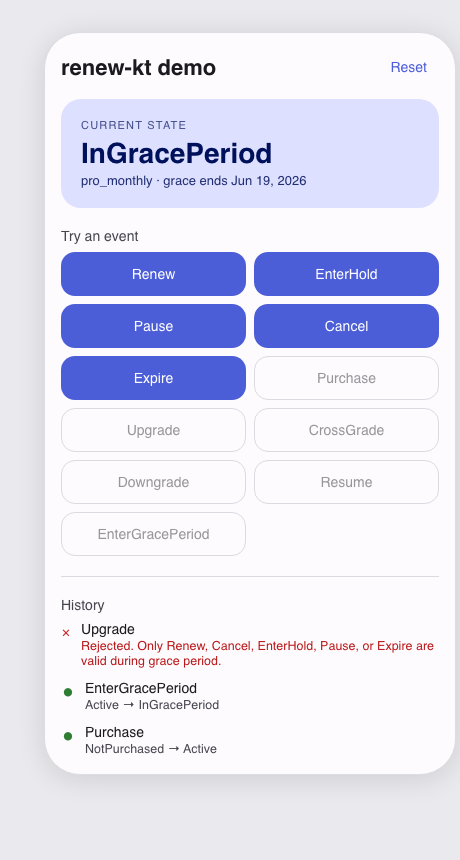
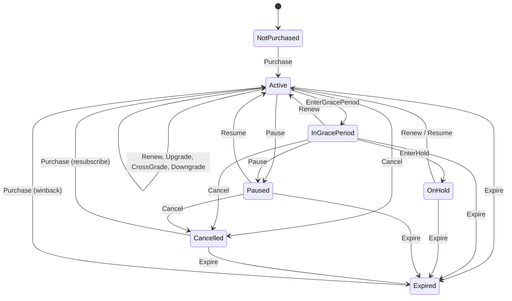

# renew-kt

> A deterministic, well-tested Kotlin state machine for Google Play Billing subscriptions.

[](https://central.sonatype.com/artifact/com.rishabhships/renew-kt)
[](https://github.com/rishabhships/renew-kt/actions/workflows/ci.yml)
[](https://opensource.org/licenses/Apache-2.0)
[](https://kotlinlang.org)

<p align="center">
  
</p>

Every subscription comes down to one question: *does it renew?* And the answer is
never a simple yes or no &mdash; it depends on grace periods, account holds, pauses,
cancellations, upgrades, downgrades, and cross-grades. **Renew** is a Kotlin
library that models the answer as an explicit state machine, rejecting invalid
transitions with descriptive errors instead of letting your app silently end up
in an inconsistent state.

> **Try the demo** &mdash; a small Compose app in [`samples/android/`](samples/android/) lets you drive
> the state machine interactively. Filled buttons are valid transitions from the
> current state; outlined buttons would be rejected, and tell you why.

## Why this exists

If you've integrated Google Play Billing for subscriptions, you've probably hit
questions like:

- *Can a user upgrade while in grace period?*
- *What state are they in if the renewal succeeds during account hold?*
- *If they pause then cancel, what happens to the expiry timestamp?*

The [Play Billing docs](https://developer.android.com/google/play/billing/subscriptions)
answer these &mdash; but the answers live across multiple pages, and the SDK hands
you an event stream rather than a state model. Renew makes the state model
**explicit, testable, and architecture-agnostic**.

## Quick example

```kotlin
val machine = SubscriptionStateMachine()

// Start with no purchase
var state: SubscriptionState = SubscriptionState.NotPurchased

// User purchases pro_monthly
state = machine
    .reduce(state, SubscriptionEvent.Purchase("pro_monthly", expiryEpochMs = 1_700_000_000_000L))
    .require()
// state is now Active(productId = "pro_monthly", ..., autoRenew = true)

// Billing fails — enter grace
state = machine
    .reduce(state, SubscriptionEvent.EnterGracePeriod(gracePeriodEndEpochMs = 1_700_500_000_000L))
    .require()
// state is now InGracePeriod(...)

// Try to upgrade while in grace — invalid
val attempt = machine.reduce(
    state,
    SubscriptionEvent.Upgrade("pro_yearly", newExpiryEpochMs = 1_730_000_000_000L),
)
// attempt is TransitionResult.Invalid(
//   reason = "Only Renew, Cancel, EnterHold, Pause, or Expire are valid during grace period."
// )
```

## State diagram



## States

| State | Meaning |
|---|---|
| `NotPurchased` | No subscription has ever been purchased. |
| `Active` | Subscription is active and billing normally. Carries product, expiry, and auto-renew flag. |
| `InGracePeriod` | Billing failed; user still has access while Play retries. |
| `OnHold` | Grace period expired without recovery; access lost but recoverable. |
| `Paused` | User-initiated pause; resumes automatically or manually. |
| `Cancelled` | User cancelled; access continues until expiry. |
| `Expired` | Subscription is fully gone. The user previously held a subscription. |

## Design principles

1. **Explicit transitions.** Every event in every state either produces a new state
   or is rejected with a reason. No silent fall-throughs, no implicit defaults.
2. **Pure Kotlin, no Android dependencies.** Renew is a plain Kotlin/JVM library.
   Use it in Android, in your server-side subscription processor, in a CLI replay
   tool for support engineers, or in tests.
3. **Stateless reducer.** `SubscriptionStateMachine.reduce()` is a pure function:
   pass state and event in, get a `TransitionResult` out. No external state, no
   side effects. Trivially testable, trivially poppable into MVI / Redux / MVVM.
4. **Play Billing-aligned terminology.** Renew uses the same vocabulary as the
   Google Play Billing documentation so concepts transfer directly to and from
   the SDK.

## Play Billing RTDN adapter

If you process Google Play [real-time developer notifications](https://developer.android.com/google/play/billing/rtdn-reference)
server-side (recommended), [`RTDNAdapter`](lib/src/main/kotlin/com/rishabhships/renew/RTDNAdapter.kt)
maps notification types directly to Renew events:

```kotlin
// Inside your RTDN Pub/Sub handler, after fetching full details via
// Subscriptions.get on the Play Developer API:
val event = RTDNAdapter.toEvent(
    notificationType = RTDNNotificationType.SUBSCRIPTION_RENEWED,
    productId = "pro_monthly",
    expiryEpochMs = details.expiryTimeMillis,
)

event?.let { stateMachine.reduce(currentState, it) }
```

The adapter returns `null` for informational-only notification types
(`PRICE_CHANGE_CONFIRMED`, `DEFERRED`, `PAUSE_SCHEDULE_CHANGED`,
`PENDING_PURCHASE_CANCELED`) so you can ignore them safely.

## Installation

Available on [Maven Central](https://central.sonatype.com/artifact/com.rishabhships/renew-kt).

```kotlin
// Gradle (Kotlin DSL)
implementation("com.rishabhships:renew-kt:0.3.0")
```

```groovy
// Gradle (Groovy DSL)
implementation 'com.rishabhships:renew-kt:0.3.0'
```

```xml
<!-- Maven -->
<dependency>
    <groupId>com.rishabhships</groupId>
    <artifactId>renew-kt</artifactId>
    <version>0.3.0</version>
</dependency>
```

## Project layout

```
renew-kt/
├── lib/                    Pure Kotlin/JVM library — the state machine itself
└── samples/
    └── android/            Compose demo app driving the state machine live
```

The library has no Android dependencies. Use it from your Android app, from your
server-side subscription processor, or from a CLI replay tool.

## Roadmap

- [x] **v0.1** &mdash; Core state machine + comprehensive tests
- [x] **v0.2** &mdash; Play Billing RTDN notification adapter (pure-JVM, no Android deps)
- [x] **v0.2.x** &mdash; Compose sample app showing the state machine in action
- [x] **v0.3** &mdash; Maven Central publication
- [ ] **v0.4** &mdash; Client-side `Purchase` adapter that takes a Play Billing SDK
  `Purchase` + previous state and infers the correct event
- [ ] **v0.5** &mdash; `SubscriptionStore` &mdash; a Coroutine `StateFlow`-backed wrapper
  for reactive observation
- [ ] **v0.6** &mdash; Room persistence helpers

## Running tests

```bash
./gradlew :lib:test
```

## Running the sample

```bash
./gradlew :samples:android:installDebug
```

See [`samples/android/README.md`](samples/android/README.md) for details.

## Contributing

Contributions welcome &mdash; especially around real-world edge cases. If you've
hit a state transition that Renew models incorrectly (or doesn't model at all),
open an issue with a description of the scenario.

## License

Apache 2.0 &mdash; see [LICENSE](LICENSE).

## Author

Built by [Rishabh Gupta](https://rishabhships.com), a senior Android engineer
working on consumer subscription products at billion-install scale.
